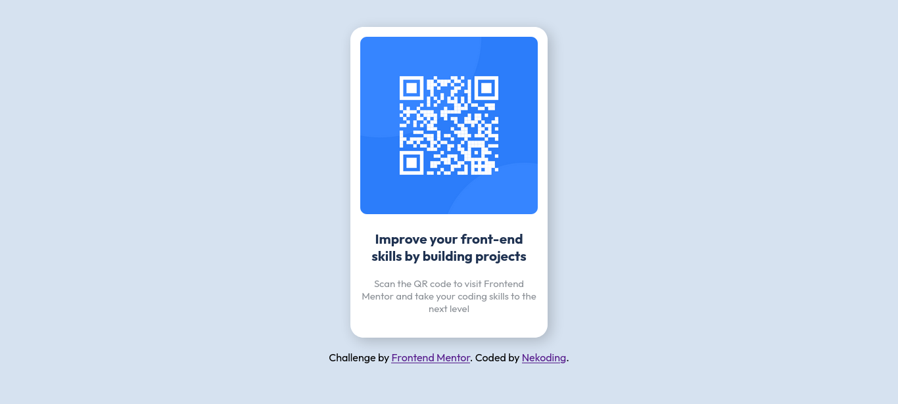

# Frontend Mentor - QR code component solution

This is a solution to the [QR code component challenge on Frontend Mentor](https://www.frontendmentor.io/challenges/qr-code-component-iux_sIO_H). Frontend Mentor challenges help you improve your coding skills by building realistic projects.

## Table of contents

- [Overview](#overview)
  - [Screenshot](#screenshot)
  - [Links](#links)
- [My process](#my-process)
  - [Built with](#built-with)
  - [What I learned](#what-i-learned)
  - [Useful resources](#useful-resources)
- [Author](#author)
- [Acknowledgments](#acknowledgments)

## Overview

### Screenshot

### Links

- Solution URL: [Github](https://github.com/nekoding/frontendmentor-qr-code)
- Live Site URL: [Demo site](https://nekoding-qr-code)

## My process

### Built with

- Semantic HTML5 markup
- CSS custom properties
- Flexbox

### What I learned

- CSS Flexbox

### Useful resources

- [Flexbox guide](https://css-tricks.com/snippets/css/a-guide-to-flexbox/) - This helped me for centering the card using flexbox.

## Author

- Website - [Enggar Tivandi](https://www.nekoding.my.id)
- Frontend Mentor - [@nekoding](https://www.frontendmentor.io/profile/nekoding)
